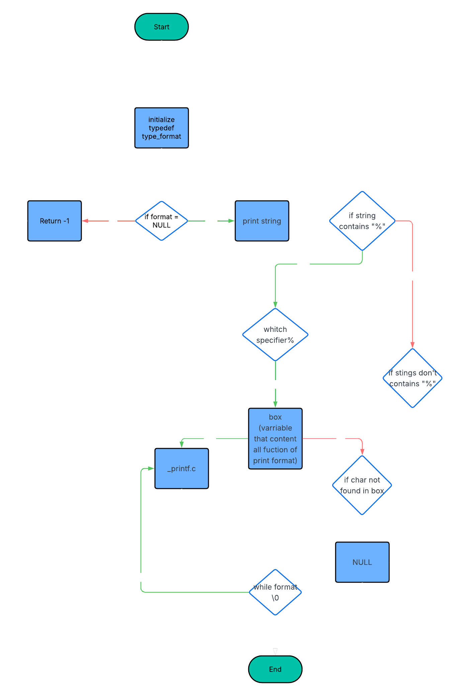

# C - Group \_printf project

---

## Table of contents

- Description
- Flowchart
- Command Compilation
- Requirements
- Authorized functions and macros
- Features (supported specifiers)
- Files in this repo
- Usage examples
- Contributing & style
- Authors

---

## Description

Our goal is to create our own `_printf` function, working as a duo, that replicates the behavior of the original `printf` function. In C, `printf()` is used to display formatted output on the standard output (`stdout`). It is part of the C standard library `<stdio.h>` and allows developers to format text in many different ways using format specifiers (such as `%d`, `%s`, `%c`, etc.).
In our project, we aim to implement a custom version of this function by handling various format specifiers, managing variable arguments, and ensuring behavior as close as possible to the real printf. This will help us deepen our understanding of formatting, memory management, and the inner workings of standard library functions.

---

## Flowchart



---

## Command Compilation

`$ gcc -Wall -Werror -Wextra -pedantic -std=gnu89 -Wno-format *.c`

---

## Requirements

- Follow the Holberton/Betty style rules where required.
- Avoid the use of global variables.
- Restrict the number of functions in a file to no more than 5.
- Include the prototypes of all functions in your header file, named main.h.

---

## Authorized functions and macros

- write (man 2 write)
- va_start (man 3 va_start)
- va_end (man 3 va_end)
- va_copy (man 3 va_copy)
- va_arg (man 3 va_arg)

---

## Features (supported format specifiers)

This repository implements (at least) the following specifiers:

- `%c` — print a single character
- `%s` — print a string (prints `(null)` for NULL pointers)
- `%d` / `%i` — print a signed integer in base 10
- `%%` — print a literal percent sign

These are implemented by functions located in `functions.c` (for example `print_char`, `print_string`, `print_integer` and `print_percent`). Additional parsing/format code lives in `print_format.c` and `_printf.c`.

---

## Files in this repository

- `_printf.c` — main `_printf` entry and dispatcher
- `_putchar.c` — helper to write individual characters
- `functions.c` — implementations of printing for `%c`, `%s`, `%d/%i`, `%%`
- `print_format.c` — format-parsing and helper functions
- `main.c` — example / test harness (may contain sample usage)
- `main.h` — project header with prototypes and includes

---

## Usage examples

Assuming you've compiled the repository into an executable or are linking `_printf` into another program, here are quick examples showing usage and expected output for the supported specifiers:

Example C usage (from `main.c` or your test program):

```c
_printf("Length:[%d, %i]\n", len, len);
_printf("Negative:[%d]\n", -762534);
_printf("Character:[%c]\n", 'H');
_printf("String:[%s]\n", "I am a string !");
```

Expected output:

```
Length:[39, 39]
Negative:[-762534]
Character:[H]
String:[I am a string !]
```

Advice: run your compiled binary (for example `./_printf_test`) to exercise the examples or make your own `main.c` that calls `_printf`.

---

## Authors

[@Arnaud Messenet](https://github.com/Crypoune)

[@David Dufont](https://github.com/dufontdd)
